# Cirqle CRM — Deployed Product QA, Security, and Product Audit

- **Audit date:** July 28, 2026
- **Production URL:** https://cirqle-taupe.vercel.app
- **Vercel project:** `cirqle` (`prj_EDqLsrp1CHIGhTilF9rIaTZ2utQR`)
- **Production deployment:** `dpl_8a54BzowGenqAUNSppeC2DAvAdxW`
- **Audited commit:** `d7d7a3a4ecc42f246f411cc67ae09e0b78965c07`
- **AI gateway:** LiteLLM on Railway (`litellm-production-2a63.up.railway.app`)
- **Firebase project:** `cirqle-9dd06`
**Code scope:** Web application, Vercel API, Firebase, and LiteLLM/Railway. The standalone mobile worktree was not inspected or changed.

**Implementation branch:** `codex/full-product-hardening`

## Executive verdict

**Release status: not ready for new-user production traffic.**

The core CRM is coherent, visually distinctive, and largely functional once a user has a valid LiteLLM key. Eleven of twelve model-backed paths were successfully exercised in the deployed application, at negligible cost. Contact ingestion, relationship notes, meeting logging, commitments, reply processing, outreach drafting, global AI search, templates, tracker views, graph, settings, and most dashboard behavior worked.

Three launch blockers must be fixed before inviting new users:

1. **Every new account currently fails automatic AI-key provisioning.** `/api/register-user` sends LiteLLM's Enterprise-only `tags` property. Production logs show three identical 403 failures.
2. **The key-generation endpoint is unauthenticated.** Anyone who discovers it can submit arbitrary `userId` values and mint repeated $5 virtual keys against the master account.
3. **The deployed Firestore rules are stale.** The repository contains tested rules for public cards and captures, but production has only the owner-only `/users` rules. Consequently, card publishing fails in the live product.

The product is suitable for continued controlled development and beta QA after manually provisioning a key. It is not suitable for self-serve signup until the P0 items in this report are implemented and retested.

## What was tested

### Test identities

| Purpose | Email | Firebase UID | LiteLLM state |
|---|---|---|---|
| Full-flow QA data account | `dev.qa.20260728@cirqle.test` | `I5HlaYXACzUqmUrC6qWWqkw06QI3` | $5 cap; $0.0024 observed spend |
| Clean handoff account | `dev.handoff.20260728@cirqle.test` | `PXSPezdKZZhDUKNrzkrsn59U1YH3` | Key alias `dev-handoff-20260728`; $5 monthly cap; $0.0001 observed spend |

No passwords or raw virtual keys are recorded in this report. The handoff account was validated against the deployed AI parser and left with no saved contacts.

### Method

- Used the actual production deployment in the in-app browser.
- Used regular Firebase email/password authentication.
- Inspected Vercel production runtime errors.
- Inspected the live LiteLLM dashboard, model routes, virtual-key budgets, request logs, and usage.
- Inspected the live Firebase Authentication, Firestore data, rules, and App Check consoles.
- Compared deployed behavior with the exact source files on `main`.
- Ran local TypeScript, build, Firestore rules, and function-emulator checks.
- Minimized AI traffic; the full-flow account consumed approximately $0.0024.

### Automated baseline

| Check | Result | Notes |
|---|---|---|
| `npm run lint` | Pass | TypeScript completed with no errors. |
| `npm run build` | Pass with warning | Production build completed. Vite reported chunks over 500 kB; the main bundle, Settings, PDF worker, and graph deserve performance work. |
| Firestore rules tests | Pass | 31/31 passed against the repository rules. |
| Capture Cloud Function tests | Environment-blocked | The Functions emulator could not load because `firebase-functions` was not installed in the local `functions` runtime. Three tests then timed out; one non-trigger case passed. Install function dependencies and rerun before treating these as product failures. |

## Production architecture and model flow

```mermaid
flowchart LR
    A["Feature chooses a tier<br/>fast / reasoning / draft"] --> B["src/lib/aiConfig.ts<br/>tier → stable alias"]
    B --> C["src/lib/ai.ts and aiClient.ts<br/>OpenAI-compatible request"]
    C --> D["User's capped LiteLLM virtual key"]
    D --> E["Railway LiteLLM<br/>/v1/chat/completions"]
    E --> F["litellm-proxy/config.yaml<br/>alias → provider model"]
    F --> G["Gemini or DeepSeek"]
    G --> H["Parsed text or JSON returned to feature"]
```

Current production tiers:

| Tier used by features | Stable alias sent by the web app | Live provider route |
|---|---|---|
| `fast` | `gemini-2.5-flash-lite` | `gemini/gemini-2.5-flash-lite` |
| `reasoning` | `deepseek-v4-flash` | `deepseek/deepseek-v4-flash` |
| `draft` | `deepseek-v4-pro` | `deepseek/deepseek-v4-pro` |

The roles of each layer are intentionally different:

- **Feature hard-coding** decides the type of work. A parser should request `fast`; a judgment or synthesis should request `reasoning`; user-facing copy where quality is the product should request `draft`.
- **`src/lib/aiConfig.ts`** maps those semantic tiers to stable aliases. Vite environment overrides can replace any tier alias at build time.
- **The per-user virtual-key model allowlist** limits which aliases a user may call. Today that list is created by `api/register-user.js`.
- **`litellm-proxy/config.yaml`** is the actual routing table. It determines which provider and provider model receives an alias. It is also the central place to change a provider model without rewriting every feature.
- **The LiteLLM master key** is administrative. It creates and manages per-user virtual keys and should never be exposed to the browser.
- **The per-user virtual key** is the browser's current credential. It is capped at $5 and only has the three production aliases.

### How to change a model safely

For a provider/model swap that preserves an existing alias, update only the alias's `model:` route in `litellm-proxy/config.yaml`, verify the provider credential, restart/redeploy LiteLLM, and smoke-test the three tiers. No web rebuild should be required.

If the alias itself changes, all of the following must remain synchronized:

1. `litellm-proxy/config.yaml`
2. `src/lib/aiConfig.ts` or the corresponding `VITE_AI_MODEL_*` environment variable
3. The `models` allowlist in `api/register-user.js`
4. Existing LiteLLM virtual keys, which must be updated or regenerated to permit the new alias
5. Documentation and smoke tests

This is why `config.yaml` matters: an alias that exists in the app but is absent or misrouted in LiteLLM produces a healthy gateway process that still returns model-level 404s. Service health and model-route health are separate.

## AI feature test matrix

The deterministic relationship-health and event-recap features were intentionally excluded from model counts; they do not call a model.

| # | Product feature | Tier / live model | Result | QA notes |
|---:|---|---|---|---|
| 1 | Directory AI Magic Parse | `fast` / Gemini 2.5 Flash Lite | Pass | Parsed name, company, role, location, and summary accurately. Also succeeded on the clean handoff account. |
| 2 | CSV import normalization | `fast` / Gemini 2.5 Flash Lite | Pass | Correctly normalized deliberately messy headers and created the expected contact. |
| 3 | Process Reply | `reasoning` / DeepSeek V4 Flash | Pass with workflow flaw | Summary and next action were useful. It only updates the latest outreach and has no explicit thread selector. |
| 4 | AI Tags | `fast` / Gemini 2.5 Flash Lite | Pass | Produced two relevant tags grounded in the contact record. |
| 5 | Draft Outreach | `draft` / DeepSeek V4 Pro | Pass with grounding flaw | Copy quality was good, but it invented an attached one-pager and implied unsupported prior work. |
| 6 | Dashboard weekly priorities | `reasoning` / DeepSeek V4 Flash | Pass with truthfulness risk | Rendered correctly, but repeated a misleading “No response” state caused by tracker chronology/status. |
| 7 | Global natural-language search | `reasoning` / DeepSeek V4 Flash | Pass | Returned the expected contact and a sensible explanation. |
| 8 | Voice memo summary | `fast` / Gemini 2.5 Flash Lite | Pass | Typed fallback saved immediately and background enrichment completed. |
| 9 | Voice commitment extraction | `reasoning` / DeepSeek V4 Flash | Pass | Extracted three correct commitments from the memo. |
| 10 | Pre-meeting brief | `reasoning` / DeepSeek V4 Flash | Blocked by preview fixture | The late-night mock-event bug made no upcoming event eligible. The model route itself was already proven by other reasoning calls. |
| 11 | Dormant-contact opener | `reasoning` / DeepSeek V4 Flash | Pass with hallucination | Invented that the user had been following the contact's firm's operational-efficiency work. |
| 12 | Public card AI draft | `draft` / DeepSeek V4 Pro | Pass | Draft created. Publishing then failed because production Firestore rules do not contain `/cards`. |

Observed full-flow request mix: four `fast`, five `reasoning`, and two `draft` calls succeeded. The full-flow key spent approximately **$0.0024 of $5**. The handoff smoke test spent **$0.0001 of $5**.

## End-to-end product flow results

### Authentication and onboarding

| Flow | Result | Detail |
|---|---|---|
| Email/password account creation | Partial | Firebase account creation works, but automatic AI-key issuance fails on every new account. |
| Email/password sign-in | Pass with transient failure | One login returned `auth/network-request-failed`; retry immediately succeeded. |
| Google sign-in | Not retested | Existing deployment was already known to support it; this audit focused on the requested regular dev login. |
| Five-step product tour | Pass | The full-flow account completed and persisted the tour. |
| Email verification | Missing | New email/password users can immediately use the app without verifying ownership. |
| Forgot/reset password | Missing | No visible recovery flow. |
| Account deletion | Missing | No user-facing deletion or complete backend cascade. |
| Error UX | Needs work | Raw Firebase error identifiers can reach users instead of clear recovery instructions. |

`TourContext` marks `hasSeenInitialTour: true` as soon as the tour is opened, not when it is completed. A crash, close, or accidental dismissal can therefore permanently suppress onboarding. Change this to mark completion only at the final step or explicit “Skip tour.”

### Directory and contact management

| Flow | Result | Detail |
|---|---|---|
| AI Magic Paste | Pass | Accurate structured extraction. |
| AI CSV import | Pass | Messy headers were normalized successfully. |
| Manual contact creation | Pass | Contact created as expected. |
| Directory search and tier filter | Pass | Filters returned expected records. |
| Quick note | Pass | Saved and appeared in the timeline. |
| Why they matter | Pass | Saved and reused by AI context. |
| Pin contact | Pass | State persisted. |
| Relationship health | Pass | Deterministic calculation rendered correctly. |
| Log meeting | Pass | Timeline event and follow-up data saved. |
| Voice memo typed fallback | Pass | Note saved first; summary and commitments enriched in the background. |
| Full contact edit | Missing | There is no complete edit form for name, email, company, role, location, etc. |
| Single-contact delete/archive | Missing | Only the destructive “Clear Directory” exists. |
| Clear Directory | Not executed | Deliberately avoided because it is destructive and the audit had test data to preserve. |

The absence of a normal contact edit/archive/delete workflow is a significant CRM usability gap. Imported data will always contain mistakes, duplicates, and changing job details.

### Outreach, replies, templates, and tracker

| Flow | Result | Detail |
|---|---|---|
| AI outreach draft | Pass with grounding risk | Good tone and structure; fabricated an attachment and unsupported context. |
| Mail-client handoff | Functional but unsafe semantics | Opens `mailto:`, but the app immediately records the outreach as sent and begins tracking before the user actually sends it. |
| Reply processing | Pass with mapping gap | Good summary/action. It targets the latest outreach rather than letting the user choose the thread. |
| Tracker sheet | Pass | Record displayed correctly. |
| Tracker timeline | Pass | Interaction chronology rendered. |
| Queue/recruiting/firm/industry views | Pass | All view modes rendered without runtime errors. |
| Template create/edit | Pass | Library operations worked. |
| Use a template during compose | Missing | Templates are isolated from the AI outreach composer, making the library a dead end. |
| Tracker CSV export | Not executed | UI present; no need to download user data during this audit. |
| Clear tracker history | Not executed | Destructive action intentionally skipped. |

The most serious trust issue is the `mailto:` flow in `src/pages/ContactDetail.tsx:275-319`: a handoff to an external mail client is not proof of delivery. “Sent,” follow-up timers, and reply tracking must not begin until the product has a verified provider send result or the user explicitly confirms sending.

### Dashboard, graph, calendar, and settings

| Flow | Result | Detail |
|---|---|---|
| Follow-up queue | Pass | Empty state and populated statistics worked. |
| Weekly AI brief | Pass with truthfulness risk | Rendered successfully; conclusions can be wrong when tracker status is stale. |
| Commitments panel | Pass | Background extraction later populated three correct commitments. |
| Dormant digest/opener | Pass with hallucination | Digest UI worked; generated opener invented company-specific context. |
| Network graph | Pass | Strongest premium visual surface. Nodes and search filtering worked. |
| Calendar month navigation | Pass | Preview calendar rendered and navigated. |
| Schedule follow-up → calendar | Inconclusive | Automated date entry did not reliably trigger React state, so no product failure is claimed. |
| Google Calendar preview connection | Pass as designed | Preview/mock behavior is intentionally retained. |
| Gmail preview tracking | Pass as designed | Preview/mock behavior is intentionally retained. |
| Profile settings | Pass | Name, role, bio, company, and target context saved. |
| Resume PDF extraction | Not tested | No synthetic/private resume was uploaded. |
| Production “Seed Test Data” | Needs decision | Helpful for demos but too prominent and risky in the production product. |

### Public card

| Flow | Result | Detail |
|---|---|---|
| AI card draft | Pass | Generated intro/accent/layout. |
| Publish card | Fail | Live toast: “Could not publish the card. Try again.” |
| Public card viewer | Blocked | No card could be published. |
| vCard download | Blocked | Depends on a published card. |
| Anonymous reverse capture | Blocked | Depends on a published card and deployed capture rules. |

Root cause: local `firestore.rules` contains `/cards/{cardId}` and `/captures/{captureId}` rules, and all 31 rules tests pass. The Firebase console's deployed rules contain only the owner-only `/users/{userId}` block. This is deployment drift, not a defect in the checked-in rules.

## Security and privacy findings

### P0 — Unauthenticated arbitrary LiteLLM key generation

**Evidence**

- `api/register-user.js:9` trusts `req.body.userId`.
- No Firebase ID token is required or verified.
- The endpoint uses the LiteLLM master key to call `/key/generate`.
- `api/register-user.js:36` creates a timestamped alias, so repeated requests are non-idempotent.
- Each key is capped at $5, but an attacker can submit unlimited new arbitrary IDs unless LiteLLM adds another global constraint.

**Impact**

Cost abuse, virtual-key sprawl, polluted spend attribution, and exhaustion of provider/master budget.

**Required fix**

Require `Authorization: Bearer <Firebase ID token>`, verify it server-side with Firebase Admin, ignore any client-provided owner ID, and derive `userId` from the verified token's `uid`. Add rate limiting, idempotency, and a lookup/reuse path keyed by Firebase UID.

**Acceptance criteria**

- Missing, expired, or forged tokens return 401.
- A valid user cannot request a key for another UID.
- Ten concurrent requests for the same UID produce one active virtual key.
- Repeated login does not rotate or duplicate the key.
- Server logs never contain raw virtual keys or the master key.

### P0 — Automatic key issuance is broken for all new users

**Evidence**

- `api/register-user.js:44` sends `tags: ["cirqle-web"]`.
- LiteLLM production returns 403 because `tags` is Enterprise-only.
- Vercel showed three matching failures on `/api/register-user` between 9:21 PM and 10:02 PM ET.
- The handoff account required manual provisioning.

**Required fix**

Remove the unsupported `tags` field unless an Enterprise license is deliberately purchased and configured. Add an integration test against the actual LiteLLM API shape or a contract-faithful mock.

**Acceptance criteria**

A brand-new email/password user reaches the app, receives one $5/30-day key restricted to the three production aliases, and successfully completes one `fast` call without administrator intervention.

### P0 — Production Firestore rules are stale

**Evidence**

- Repository `firestore.rules:40-79` includes public-card and validated capture rules.
- Repository tests pass 31/31.
- Deployed Firebase rules omit `/cards`, `/captures`, and the server-only `/oauthTokens` block.
- Live card publish fails.

**Required fix**

Deploy the repository rules to `cirqle-9dd06`, confirm the deployment version, and add rules deployment to the controlled release pipeline.

**Acceptance criteria**

- Owner can create, update, and delete their card.
- Anonymous visitor can read a published card.
- Anonymous visitor can create only a shape-valid capture.
- Anonymous visitor cannot list/read/update/delete captures.
- Another signed-in user cannot edit the card or read the owner's private user data.
- All local rules tests pass in CI and the deployed rules version is recorded.

### P1 — Raw virtual keys are stored in Firestore and browser storage

**Evidence**

- `src/layouts/AppLayout.tsx:58-91` reads the key from the user document, writes it back to Firestore, and copies it to local storage.
- `src/lib/aiClient.ts:44` reads it from local storage.

**Impact**

Any successful XSS, malicious browser extension, compromised Firebase session, or accidental console export can recover a spend-enabled credential.

**Recommended architecture**

Move AI requests behind an authenticated Vercel endpoint. The browser sends a Firebase ID token; the server resolves the user's LiteLLM key or calls LiteLLM under controlled metadata. Prefer storing only a hashed key identifier or LiteLLM user ID in Firestore. Keep raw virtual keys in a server-only secret store.

**Acceptance criteria**

No raw LiteLLM key appears in Firestore client-readable documents, local storage, JavaScript bundles, client logs, or network responses.

### P1 — Account deletion does not cascade through user data

**Evidence**

Firebase Auth users removed during earlier cleanup still have root Firestore user documents and subcollections. At least four orphan root documents remained:

- `VLRurhzam1NQyPUkXGnXbq47Wbm1`
- `VeNohNjVFOQhpOjeUMnOubae2UE2`
- `p1xbbjN1GrQAFBJF9guzIte1Iuw1`
- `zKAdA1EXxGMRs8eVsajwGaBmAcm1`

Deleting an Auth record does not recursively delete Firestore, public cards, captures, integration tokens, or LiteLLM state.

**Required fix**

Implement a server-owned deletion job that:

1. Reauthenticates and verifies the requesting user.
2. Revokes/deletes LiteLLM keys and user metadata.
3. Revokes provider OAuth tokens.
4. Recursively deletes `users/{uid}` and all subcollections.
5. Deletes or tombstones the user's public card and captures.
6. Deletes Firebase Auth last.
7. Records an auditable, non-sensitive completion receipt.

Add a separate administrator cleanup tool for existing orphans. Do not silently delete the listed documents until ownership/retention requirements are confirmed.

### P1 — Security headers are incomplete

The production HTML response had HSTS but no observed:

- Content-Security-Policy
- `frame-ancestors` or `X-Frame-Options`
- X-Content-Type-Options
- Referrer-Policy
- Permissions-Policy

Static HTML also returned `Access-Control-Allow-Origin: *`. The gateway correctly returned 401 for unauthenticated `/health` and `/v1/models`, and its own response included framing/CSP/nosniff protections.

Add headers in `vercel.json`. Start CSP in report-only mode, inventory Firebase/Google/Railway endpoints, remove unsafe allowances, then enforce. Explicitly restrict framing, camera, microphone, geolocation, and payment permissions to the minimum required.

### P1 — AI output is not sufficiently grounded

Observed hallucinations:

- Outreach claimed an attached one-pager that did not exist.
- Dormant opener claimed the user had been following specific firm work that was absent from the record.
- Weekly synthesis treated a stale tracker status as an objective fact.

Introduce a provenance-aware prompt contract:

- Separate “known facts” from “user instructions.”
- Prohibit attachments, shared history, recent news, or company activity unless present in cited context.
- Return `usedFacts` and `unsupportedAssumptions`.
- Visibly flag uncertain copy before the user sends it.
- Add a “Why this?” drawer with source notes/timeline events.
- Build fixture-based regression tests for fabrication.

### P1 — `mailto:` is treated as verified send

Opening a mail client cannot prove the user sent the message. Do not create a `Sent` tracker event or start reply polling at `src/pages/ContactDetail.tsx:275-319` until:

- Gmail/Outlook API returns a send/thread ID, or
- the user explicitly confirms “I sent it” after the handoff.

Use states such as `Drafted`, `Opened in mail client`, `Sent (confirmed)`, and `Sent (provider verified)`.

### P2 — Firebase App Check is not configured

The Firebase console displays App Check as unconfigured. Enable it for web after testing enforcement in metrics/monitor mode. App Check complements authentication; it does not replace token verification or rate limiting.

The anonymous public-card capture endpoint will remain intentionally public. Protect it with strict shape validation (already present locally), App Check where compatible, server-side throttling, honeypot/abuse signals, and per-card rate limits.

### P2 — Error details leak too much implementation context

- `api/register-user.js:78-93` returns raw LiteLLM response bodies and stack traces.
- The client AI error includes the first 140 characters of gateway/provider content.
- Auth can show raw Firebase error identifiers.

Return stable public error codes and a request ID. Keep provider bodies/stacks only in restricted server logs, with secrets redacted.

### P2 — Authentication recovery and assurance are incomplete

Add:

- Email verification with resend and restricted high-value actions until verified
- Forgot-password/reset flow
- Password guidance and breached/common-password protection
- Recent-login requirement for destructive/security actions
- User session/device list and “sign out everywhere”
- User-initiated account export and deletion

## Reliability and UX findings

### P1 — Reply processing can update the wrong outreach

`src/pages/ContactDetail.tsx:159-160` selects the newest outreach. In realistic use, a contact can have parallel threads. Let the user select the message/thread being answered, or map by provider thread ID. If confidence is low, do not mutate status automatically.

### P1 — Templates are disconnected from composing

Template creation/editing works, but the outreach composer cannot apply a template. Add a template picker with preview, variable substitution, and “save this draft as template.” Preserve AI context by treating the template as constraints, not as a competing final draft.

### P1 — Contacts need edit, merge, archive, and delete

Add:

- Full profile edit
- Archive/restore
- Soft delete with a recovery window
- Duplicate detection by normalized email/name/company
- Side-by-side merge with field-level conflict choice
- Job-change history rather than destructive overwrite

### P2 — Late-night preview events can be in the past

`src/lib/integrations/calendar.ts:112` uses:

`Math.min(now.getHours() + 1 + ..., 20)`

After 8 PM, this produces an event earlier on the same day even though the fixture claims the first meeting is ahead. The UI then shows “Just ended,” and the pre-meeting brief is unreachable. Construct times by adding minutes to `Date`, allowing the date to roll into tomorrow.

### P2 — Onboarding is marked complete too early

`src/contexts/TourContext.tsx:240-242` writes `hasSeenInitialTour: true` before completion. Record:

- `tourStartedAt`
- `tourCompletedAt`
- `tourLastStep`
- `tourSkippedAt`

Resume an interrupted tour from the last step. Do not conflate opened, skipped, and completed.

### P2 — Production demo data control is too prominent

“Seed Test Data” is visible on the production dashboard. Hide it behind a development flag, a demo workspace, or an explicitly labelled sandbox reset flow. Never allow it to mix with a user's real CRM unintentionally.

### P2 — AI latency needs a premium treatment

Draft-quality calls took roughly 12–17 seconds. During that time:

- Stream partial output where possible.
- Show stage-specific progress (“Reviewing history,” “Grounding facts,” “Drafting”).
- Allow cancellation.
- Prevent duplicate submissions.
- Preserve the user's form state on timeout.
- Offer an immediate lower-cost draft with optional “Improve” on the premium model.

### P2 — Accessibility needs a dedicated pass

Several visible labels were not associated with form controls in accessibility snapshots, including auth, meeting, settings, and template inputs. Complete keyboard-only, focus-order, screen-reader-name, contrast, reduced-motion, and error-announcement testing. Use real `<label for>`/`id` pairs or reliable `aria-labelledby`.

### P2 — User-facing spend is invisible

LiteLLM correctly attributes spend to virtual keys/users, but Cirqle gives the user no budget feedback. Add a small usage surface in Settings:

- Current period spend / $5 cap
- Reset date
- Request count by feature or tier
- A warning at 70%, 90%, and 100%
- Clear behavior when the cap is reached

Do not expose the master key or raw virtual key. Fetch sanitized usage through an authenticated server route.

### P3 — Bundle and perceived performance

The build passes, but Vite reports large chunks:

- PDF worker: approximately 2.19 MB
- Main application chunk: approximately 1.09 MB
- Settings: approximately 507 kB
- Graph: approximately 223 kB

Lazy-load PDF extraction only when the resume flow opens, isolate Firebase/admin-heavy modules, and defer the graph until its route is requested. Add route-level performance budgets and measure Core Web Vitals on production.

## Visual polish and “premium” opportunities

The product's editorial serif/monospace identity, restrained palette, graph surface, and dense-but-readable CRM layout are already distinctive. Premium polish should deepen confidence and calm rather than add visual noise.

1. **Make AI provenance visible.** Add small source chips under generated facts: “Meeting · Jul 28,” “Note · Maya,” “Profile,” or “Inferred.” This improves trust and makes the memory system feel substantial.
2. **Use a consistent generation state.** Every AI surface should share one loading/error/ready system, animation cadence, cancel action, and usage indicator.
3. **Add optimistic but reversible actions.** Notes and tags can feel instant, with undo toasts. Destructive actions should be soft deletes with recovery.
4. **Create a relationship timeline with editorial hierarchy.** Separate facts, interactions, commitments, drafts, and system suggestions through visual rhythm rather than more boxes.
5. **Show freshness.** Every synthesis should say when the underlying data was last refreshed and what sources it considered.
6. **Polish empty states into setup paths.** A zero-contact dashboard should offer “Paste a bio,” “Import CSV,” and “Try a demo workspace,” not only blank metrics.
7. **Add command-palette quality keyboard behavior.** `/` search already exists. Extend it to navigation, contact creation, logging, and composing with discoverable shortcuts.
8. **Treat errors as recovery moments.** Replace generic “Try again” messages with the failed layer, preserved work, and a clear next action.
9. **Separate preview data from real data visually.** Preview Gmail/calendar states should use a persistent but subtle “Preview” treatment and explain exactly what will change when connected.
10. **Give the graph a narrative mode.** “Why are these people connected?” and “Show the shortest warm path to X” would turn the strongest visual surface into a useful decision tool.

## Defensible moat roadmap

The moat should not be “another CRM with an LLM.” It should be a trusted, longitudinal relationship-memory system that improves from private user corrections and closed-loop outcomes.

### 1. Provenance-backed relationship memory

Store every fact as a temporal claim with:

- Source type and source ID
- When the fact was observed
- Confidence
- User correction history
- Superseded/current status

AI output should cite these claims. Over time, the product builds a private, auditable memory graph that is hard to recreate in a generic assistant.

### 2. Commitment and follow-through intelligence

Turn extracted commitments into a feedback loop:

- Was this a real commitment?
- Was it completed?
- Did the user snooze or dismiss it?
- Did the relationship outcome improve?

This creates proprietary training/evaluation data about which language predicts real follow-through.

### 3. Closed-loop communication graph

Provider-verified send/reply/thread IDs should connect:

`draft → sent → delivered → replied → meeting → commitment → outcome`

The product can then learn timing, channel, wording, and relationship patterns for each user without inventing facts.

### 4. Introduction-path intelligence

Evolve the graph from visualization to a decision engine:

- Warmest path to a target
- Likely willingness to introduce
- Relationship load/fatigue
- Mutual context worth mentioning
- Conflicts or stale edges

The private interaction graph and user corrections become defensible data.

### 5. User-controlled trust layer

Make privacy a feature:

- Clear data lineage
- Exportable memory
- Per-source retention
- “Never use this in AI” controls
- Private/encrypted sensitive notes
- Local or tenant-isolated embeddings where practical

Trust is especially valuable for executive, recruiting, investing, and professional-network use cases.

### 6. Event-mode network capture

The public card and reverse capture can become a differentiated acquisition loop if made reliable:

- Event-specific card identity
- QR/NFC capture provenance
- Automatic dedupe
- Consent-first follow-up
- Event recap and next-action queues
- Organizer/attendee network maps without exposing private contacts

Keep captures tightly rate-limited and privacy-scoped.

## Prioritized implementation plan

The following tasks are written so another implementation agent can execute them.

### Phase 0 — Stop launch blockers

#### P0.1 Secure and repair `/api/register-user`

**Files:** `api/register-user.js`, new server Firebase Admin helper, relevant Vercel environment documentation/tests.

**Work**

1. Remove `tags`.
2. Require and verify a Firebase ID token.
3. Derive UID from the verified token.
4. Make key creation idempotent by deterministic alias/metadata lookup.
5. Restrict models to the three production aliases.
6. Preserve $5 cap and 30-day/monthly reset.
7. Add per-UID/IP throttling.
8. Return stable public errors with request IDs; remove stack/provider bodies.
9. Add tests for unauthorized, cross-user, duplicate, LiteLLM 403/500, and success cases.

**Done when:** a fresh account automatically receives one working capped key, repeated requests reuse it, and forged/cross-user requests fail.

#### P0.2 Deploy and lock Firestore rules

**Files:** `firestore.rules`, `firebase.json`, CI/release configuration, `tests/firestore-rules.test.mjs`.

**Work**

1. Confirm the repository rules are the intended production policy.
2. Run rules tests.
3. Deploy rules to `cirqle-9dd06`.
4. Verify the active Firebase rules version contains `/cards`, `/captures`, and `/oauthTokens`.
5. Add a release check that fails if deployed rules drift from the repository.
6. Smoke-test card publish/read/capture/owner read/attacker denial.

**Done when:** the live public-card flow passes end to end and unauthorized access remains denied.

#### P0.3 Add production signup smoke coverage

Create a disposable-account test that:

1. Creates an email/password user.
2. Signs in.
3. Confirms one key exists with a $5 cap and three aliases.
4. Runs one tiny `fast` parse.
5. Deletes LiteLLM, Firestore, card, and Auth data.

Run it against preview before production promotion. Never log credentials or keys.

### Phase 1 — Repair trust, privacy, and core CRM workflows

#### P1.1 Move AI calls behind the authenticated server

**Files:** `src/lib/aiClient.ts`, `src/layouts/AppLayout.tsx`, `api/*`, Firestore schema/rules.

Remove raw virtual keys from client-readable storage. Proxy AI through a verified server route with user/tier attribution, budget checks, size limits, timeouts, and sanitized errors.

#### P1.2 Implement complete account deletion

Add a Settings danger-zone flow and server deletion job covering LiteLLM, OAuth, Firestore subcollections, cards/captures, and Firebase Auth. Add retry-safe job state and a test fixture proving no orphaned data remains.

#### P1.3 Correct outreach truth states

**File:** `src/pages/ContactDetail.tsx` plus Gmail/Outlook adapters and tracker types.

Replace the current immediate `Sent` transition with:

- Drafted
- Opened in mail client
- Sent — user confirmed
- Sent — provider verified
- Delivered/replied when provider-confirmed

Only provider-verified threads should be polled automatically.

#### P1.4 Add AI grounding and provenance

**Files:** every prompt call site, shared AI schema/helpers, UI `AISurface`.

Create a shared grounded-generation schema, show used sources, block unsupported attachments/history, and add regression fixtures for the observed hallucinations.

#### P1.5 Add contact edit/archive/delete/merge

Preserve history, avoid hard deletes by default, and update graph/tracker/commitment references safely during merges.

#### P1.6 Connect templates to compose

Add “Use template” to outreach drafting, variables, preview, and “Save as template.” Test both manual and AI-assisted compose.

### Phase 2 — Harden and polish

#### P2.1 Security headers and App Check

Add Vercel headers, deploy CSP report-only then enforce, configure Firebase App Check in monitor mode, and rate-limit public capture.

#### P2.2 Auth recovery and assurance

Add verification, reset password, reauthentication, session revocation, export, and deletion.

#### P2.3 Fix preview event rollover and tour persistence

Fix date arithmetic in `src/lib/integrations/calendar.ts` and change tour state to completion-based persistence in `src/contexts/TourContext.tsx`.

#### P2.4 Accessibility pass

Associate every label/control, make generation/status announcements live-region aware, verify keyboard-only use, and test reduced motion.

#### P2.5 Usage and budget UX

Create a sanitized authenticated usage endpoint and show spend, cap, reset, alerts, and exhausted-budget recovery in Settings.

#### P2.6 Performance

Lazy-load PDF, graph, and heavy Settings code; add production Core Web Vitals and bundle budgets.

### Phase 3 — Build the moat

1. Temporal fact ledger with provenance and corrections.
2. Closed-loop provider-verified communication outcomes.
3. Commitment quality feedback and completion learning.
4. Actionable introduction-path intelligence.
5. Event-mode capture with provenance, dedupe, and consent.
6. Privacy controls, lineage, export, and sensitive-memory boundaries.

## Retest checklist

An implementation agent should not declare the audit closed until all of the following pass on the deployed Vercel production candidate:

- [ ] New email/password signup automatically receives exactly one capped key.
- [ ] Unauthorized and forged `/api/register-user` requests return 401.
- [ ] Cross-user key requests are impossible.
- [ ] The user's key permits only the three intended aliases.
- [ ] Key spend and reset appear correctly in LiteLLM and sanitized Settings UI.
- [ ] Magic Paste, CSV import, AI tags, reply processing, outreach draft, weekly brief, global search, voice summary, commitments, meeting brief, dormant opener, and card draft all pass.
- [ ] Grounding fixtures prevent invented attachments, prior interactions, and company activity.
- [ ] Public card publish, anonymous read, valid capture, owner drain/read, and vCard work.
- [ ] Attack tests for card overwrite, capture enumeration, user-doc reads, and OAuth-token reads fail.
- [ ] `mailto:` no longer creates a verified `Sent` event.
- [ ] Provider send creates the correct thread and reply state.
- [ ] Contact edit, archive, restore, delete, duplicate detection, and merge pass.
- [ ] Templates can be applied during compose.
- [ ] Interrupted onboarding resumes; completion and skip are distinct.
- [ ] Preview meetings remain upcoming after 8 PM.
- [ ] Password reset, verification, session revocation, export, and full deletion pass.
- [ ] Deleting a test user leaves no Auth, Firestore, public-card, integration-token, or LiteLLM orphan.
- [ ] CSP/security headers are present and critical flows still work.
- [ ] App Check metrics are healthy before enforcement.
- [ ] Keyboard, screen reader, contrast, reduced-motion, mobile viewport, and touch-target tests pass.
- [ ] TypeScript, production build, Firestore rules, and function-trigger tests all pass in a clean install.
- [ ] Vercel and LiteLLM logs contain no raw keys, tokens, stack traces, or provider secrets.

## Explicitly not tested

- Standalone mobile application/worktree
- Real Gmail OAuth/send/reply behavior
- Real Google Calendar OAuth/events
- Resume PDF extraction
- Public card viewer/vCard/reverse capture, because production publish is blocked by stale rules
- Destructive “Clear Directory” and “Clear Tracker” actions
- Tracker CSV file contents
- A conclusive mobile-responsive viewport pass; the in-app browser viewport override did not apply reliably
- Browser-extension or full penetration testing

## Final product assessment

Cirqle already has the beginnings of a strong product: a recognizable visual identity, a useful network graph, low-cost model routing, sensible semantic model tiers, and a cohesive relationship workflow. The main risk is not model quality or Railway health. It is trust infrastructure around the models: secure provisioning, deployed rules, truthful communication states, grounded claims, deletion, and provenance.

Fix the P0 items first. Then prioritize trustworthy send/reply state, data lifecycle, complete contact management, and grounded AI before adding breadth. The most defensible path is to make Cirqle the private, auditable memory and follow-through layer for professional relationships—not merely a contact database with drafting buttons.
